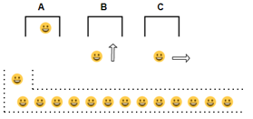

# Trabalho 01
## Objetivo
Desenvolver o programa na linguagem C conforme especificação a seguir. As especificações a seguir mostram uma implementação na linguagem Pascal, juntamente com as explicações que levaram a esta implementação. O objetivo é fazer as adaptações necessárias para a linguagem C, usando as bibliotecas implementadas em aula sobre Listas, Pilhas e Filas.

## Organização
O trabalho pode ser desenvolvido em equipes de 2 ou 3 componentes. O programa desenvolvido deve ser postado no Teams e apresentado pela equipe durante o horário da aula na data marcada.

## Cenário
O Trabalho consiste em simular uma situação que nos permita determinar qual o tempo médio que cada cliente aguarda numa fila para realizar uma transação no caixa eletrônico de uma agência bancária.

O caixa eletrônico oferece cinco opções ao cliente e, através de estatísticas, chegamos ao tempo médio necessário para realizar cada uma das transações possíveis:

| Código | Transação | Tempo |
|---|---|---|
| 0 | Saldo | 10s |
| 1 | Saque | 20s |
| 2 | Aplicação | 30s |
| 3 | Extrato Semanal | 40s |
| 4 | Extrato Mensal | 50s |

Sabe-se que a agência tem 3 caixas eletrônicos que atendem a uma única fila de clientes. À medida que qualquer um dos caixas fica livre, o primeiro cliente da fila o utiliza.

<div align="center">
    
</div>

Quando um cliente entra na fila, o horário é anotado. Quando ele sai, verifica-se quanto tempo ele aguardou e este valor é acumulado. Também o total de clientes é registrado, de modo que no final do expediente, seja possível determinar o tempo médio que um cliente permanece na fila para utilizar o caixa.

Duas entidades concretas estão envolvidas neste problema: caixas e clientes. Vamos abstrair destas entidades apenas os atributos essenciais para a resolução do problema, objetivando uma implementação simples e funcional.


Tudo que precisamos saber sobre um caixa é se ele está ocupado ou não. Caso esteja, precisamos ter uma “noção” de por quanto tempo ele ainda será usado pelo cliente. Assim, cada caixa será representado por uma variável inteira, cujo valor indica por quanto tempo ele permanecerá ocupado. Se o valor desta variável for 0 (zero), então o caixa está livre. Inicialmente, todos os caixas estão livres. Quando um cliente inicia uma transação num caixa, o tempo necessário para realizar a transação escolhida por ele é que determinará quanto tempo o caixa permanecerá ocupado.

A outra entidade que precisaremos representar é o cliente. Dele só nos interessa o momento em que ele entrou na fila para que, ao sair, possamos calcular quanto tempo ele aguardou. Portanto, cada cliente será representado por um numero inteiro correspondente ao horário/tempo que ele entrou na fila. 

Na nossa simulação, dois eventos que podem ocorrer são de interesse particular: 

* Um cliente chegar à agência e entrar na fila;
* Um caixa é liberado, alguém sai da fila e o utiliza;

Para sincronizar estes 2 eventos, vamos assumir que temos um cronômetro que marca unidades de tempo. Durante uma unidade de tempo, que poderia ser um segundo, qualquer combinação de eventos pode ocorrer, até mesmo nenhuma.

Para simular a dinâmica com que os eventos ocorrem, procedemos como segue:

* Zerar o cronômetro;
* Enquanto não terminar o expediente:
   * Se um cliente chegou, então entra na fila;
   * Se a fila não está vazia e uma caixa está livre, então cliente inicia transação;
   * Para cada caixa ocupado, decrementar o seu tempo tempo de uso;
   * Incrementar o cronômetro;

Alguns pontos do algoritmo acima devem ser detalhados para que possamos programa-los:

* **Terminou o expediente?**
   * Para determinar o final do expediente, usamos o próprio cronômetro. Para isto, basta definir o período de atendimento da agência em termos das unidades de tempos marcadas pelo cronômetro. Quando o cronômetro atingir o valor definido, então terminou o expediente.
*  **Chegou um cliente?**
   * Numa situação real, não teremos um cliente chegando à agência a cada segundo para usar o caixa eletrônico. Para implementar esta parte do algoritmo, de modo que tenhamos algo não sistemático, podemos utilizar uma função que cada chamada retorne um valor aleatório:

```
function ClienteChegou : boolean;
begin
    ClienteChegou := (random(3) = 0);
end;
```
* **Cliente entra na fila**
  * Convencionamos representar um cliente apenas pelo horário em que ele entrou na fila. O tempo está sendo controlado pelo cronômetro. Logo, colocar um cliente na fila equivalente a simplemente armazenar nela o valo corrento do cronômetro, no momento que ele chega.

* **Inicia transação**
  *  Quando um caixa é liberado e um cliente começa a utiliza-lo, precisamos saber por quanto tempo ele estará ocupado. O tempo de uso do caixa depende da transação que é iniciada pelo cliente. Aqui também é interessante que as transações iniciadas sejam aleatórias.

```
function Transacao : integer;
begin
	case random(5) of
	0: Transação := 10;
	1: Transação := 20;
	2: Transação := 30;
	3: Transação := 40;
	4: Transação := 50;
end;
```

Cada vez que a função **Transação()** é chamada, ela "sorteia" uma transação e retorna o tempo médio necessário para realiza-la. Uma vez que um caixa é representado por uma variável que especifica quanto tempo ele estará ocupado, para indicar um cliente está usando um caixa, basta selecionar uma transação e armazenar o tempo corrente na variável que representa o caixa.